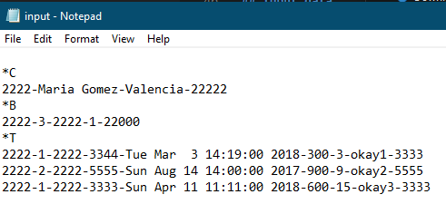

# Bank simulation
> Payment system simulation using dynamic memory

## Table of contents
- [Bank simulation](#bank-simulation)
  - [Table of contents](#table-of-contents)
  - [Introduction](#introduction)
  - [Requeriments](#requeriments)
  - [Input data](#input-data)
  - [Output](#output)
  - [Technologies](#technologies)
  - [Setup](#setup)
  - [Status](#status)
  - [Inspiration](#inspiration)
  - [Contact](#contact)

## Introduction

The essential idea of the system is that a person linked with it is able to receive and send money to another person as long as they're also affiliated with it. All the data is loaded using a text (.TXT) file and stored in a text file when the program's execution ends.

## Requeriments

1. The system should be able to register:
   1. ID
   2. Full name
   3. Address (city)
   4. Phone number
   5. List of linked bank accounts

2. Each account has:
   1. ID (long int or int to make it more simple)
   2. Bank's ID
   3. Type of account
   4. Balance

3. Each transaction has:
   1. Transaction code (unique number)
   2. Amount
   3. Type of transaction (payment/receiving money)
   4. Date and time (Wished format example: Sun Mar 12 22:00:00 2018)
   5. ID of the person involved in the transaction
   6. Description (40 characters max)

4. Accounts in the system are associated to an ID number, there can't be 2 accounts linked to different ID numbers.
   
5. When you delete an account you must consider:
   1. If a person in the system is deleted ALL the data associated to that ID number must be deleted as well
   2. If a client's bank account is deleted, all the transactions associated to that account must be also deleted.
   3. Specific transactions can be deleted (regardless if you are the person who sends it or receives it). After deleting the transaction the data must be updated as it was never done.

6. Spanish UI

## Input data

Initially, the data of each account and its transactions are stored in a text file. The file structure is the following:

* __Line 1__: "*C" Represents that the list "clients" will be filled
* __Line 2__: ID-Name-Address-Phone
* __Line 3__: "*B" Represents that the list "accounts" will be filled
* __Line 4__: Person's ID-Bank-Account's ID-Account type-Balance
* __Line 5__: "*T" Represents that the list "transactions" will be filled
* __Line 6__: Transaction's type-Issuer's account ID-Second party's ID-Date-Amount-Transaction's code-Description-Receiver's account ID
* __Line 7__: Line jump
* __Line 8__: "*C" (...) and so on

The program must validate all the possible errors in the file structure before loading the information

## Output

It's required an interactive menu with the following options

* __1. Accounts:__ Lets the user add, modify, delete and check data
  1. *System's clients*: This is not to link bank accounts, only client's data, each ID number stored in the system is unique
  2. *System's accounts*: This is to link bank accounts

* __2. Payment:__ The data that the program should ask for is the following:
  1. Issuing person's ID, if it doesn't exist in the system give an option to link the *person* to the system or to cancel the transaction
  2. Account's ID
  3. Amount of the transaction (validate with the account's balance)
  4. Ask for the receiver person's ID, if it doesn't exist in the system give an option to link the *person* to the system or to cancel the transaction
  5. Receiver person's account ID
  6. Operation's description
  7. Show all the previous data and ask the person to confirm or cancel the transaction
  8. If the person accepts, register the transaction's data in both parties accounts

* __3. Check movements:__ There's different data that the user can check for:
  1. Given a client's name show all the data that belongs to the people with that name (ID, address, phone,account IDs, bank names and balance of that account). Show the number of accounts affiliated for each person and the total balance (the sum of all balances from all their accounts).
  2. Given a client's ID show:
     1. Full name, client's code and linked account IDs, as well as each account's balance and total of payment for each account (count the ones where they're sending and receiving).
     2. Given a person's data (ID and name) show all the payment transactions done as receiver, must also show giver's data (ID, name), as well as amount, date/time. Give the option to sort them by date or by amount, show also the total amount from all the payment transactions.
     3. Given a person's data (ID and name) show all the payment transactions done as giver, must also show receiver's data (ID, name), as well as amount, date/time. Give the option to sort them by date or by amount, show also the total amount from all the payment transactions.
     4. Given a person's data (ID and name) show all the transactions sorted by account's ID, first show the payment transactions, then the charging transactions, both of them sorted by date. Show also the total amount from each account.
     5. Given a closed range of values for an amount, print all the transactions linked to that range by an increasing order, data that should be showed is: Amount, date/time, name of both parties, account's ID from both parties, ID of both parties.

* __4. Load data from a file__: All the structures can be filled from a text file

* __5. Exit:__ The program must facilitate the end of its execution

## Technologies
* Visual Studio Code with the C/C++ extension
* G++ Compiler

## Setup

Click the P2-Bank.exe file in this project's folder

## Status
Project is: _In progress_

## Inspiration
This program is an old uni project

## Contact
Created by [@metalsonic21]